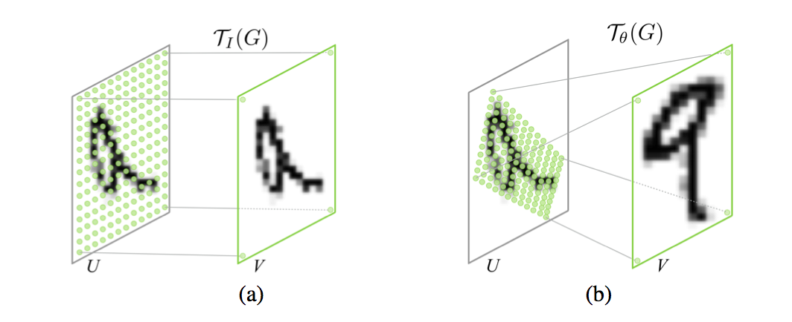
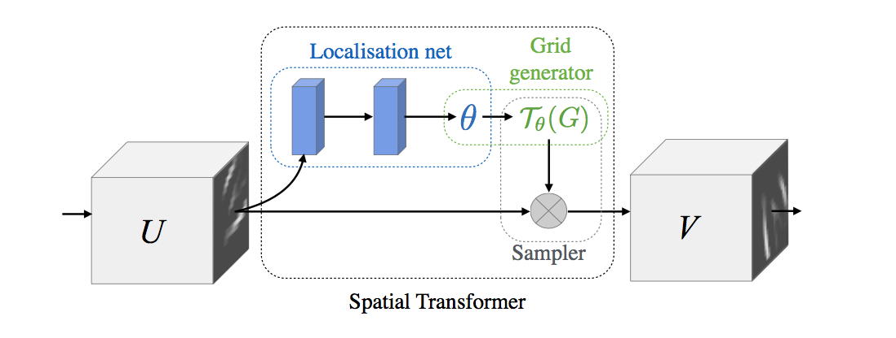
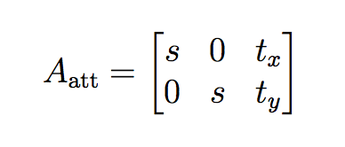
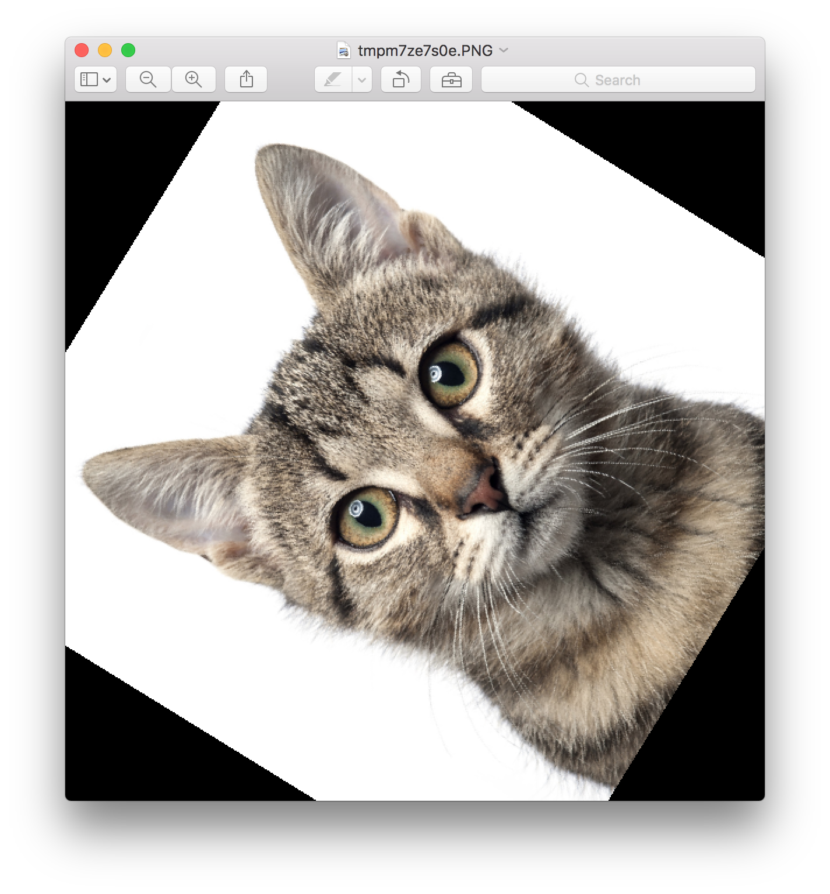

## Spatial Transformer Networks

<p align="center">
 
</p>

This is a **Tensorflow** implementation of [Spatial Transformer Networks](https://arxiv.org/abs/1506.02025) by *Max Jaderberg, Karen Simonyan, Andrew Zisserman* and *Koray Kavukcuoglu*, accompanying by two-part blog [tutorial series](https://kevinzakka.github.io/2017/01/18/stn-part2/).

*Spatial Transformer Networks* (STN) is a differentiable module that can be inserted anywhere in ConvNet architecture to increase its geometric invariance. It effectively gives the network the ability to spatially transform feature maps at no extra data or supervision cost.


## Installation

Install the `stn` package using:

```
pip3 install stn
```

Then, you can call the STN layer as follows:

```python
from stn import spatial_transformer_network as transformer

out = transformer(input_feature_map, theta, out_dims)
```

**Parameters**

- `input_feature_map`: the output of the layer preceding the localization network. If the STN layer is the first layer of the network, then this corresponds to the input images. Shape should be (B, H, W, C).
- `theta`: this is the output of the localization network. Shape should be (B, 6)
- `out_dims`: desired (H, W) of the output feature map. Useful for upsampling or downsampling. If not specified, then output dimensions will be equal to `input_feature_map` dimensions.

## Background Information

<p align="center">
 
</p>

The STN is composed of 3 elements.

- **localization network**: takes the feature map as input and outputs the parameters of the affine transformation that should be applied to that feature map.

- **grid generator:** generates a grid of (x,y) coordinates using the parameters of the affine transformation that correspond to a set of points where the input feature map should be sampled to produce the transformed output feature map.

- **bilinear sampler:** takes as input the input feature map and the grid generated by the grid generator and produces the output feature map using bilinear interpolation.

The affine transformation is specified through the transformation matrix A

<p align="center">
 
</p>

It can be constrained to one of *attention* by writing it in the form

<p align="center">
 
</p>

where the parameters `s`, `t_x` and `t_y` can be regressed to allow cropping, translation, and isotropic scaling.

For a more in-depth explanation of STNs, read the two part blog post: [part1](https://kevinzakka.github.io/2017/01/10/stn-part1/) and [part2](https://kevinzakka.github.io/2017/01/18/stn-part2/).

## Explore

Run the [Sanity Check](https://github.com/kevinzakka/spatial-transformer-network/blob/master/Sanity%20Check.ipynb) to get a feel of how the spatial transformer can be plugged into any existing code. For example, here's the result of a 45 degree rotation:

<p align="center">
 
 
</p>

**Usage Note**

You must define a localization network right before using this layer. The localization network is usually a ConvNet or a FC-net that has 6 output nodes (the 6 parameters of the affine transformation).

It is good practice to initialize the localization network to the identity transform before starting the training process. Here's a small sample code for illustration purposes.

```python
# params
n_fc = 6
B, H, W, C = (2, 200, 200, 3)

# identity transform
initial = np.array([[1., 0, 0], [0, 1., 0]])
initial = initial.astype('float32').flatten()

# input placeholder
x = tf.placeholder(tf.float32, [B, H, W, C])

# localization network
W_fc1 = tf.Variable(tf.zeros([H*W*C, n_fc]), name='W_fc1')
b_fc1 = tf.Variable(initial_value=initial, name='b_fc1')
h_fc1 = tf.matmul(tf.zeros([B, H*W*C]), W_fc1) + b_fc1

# spatial transformer layer
h_trans = transformer(x, h_fc1)
```

## Attribution

- [Torch Blog Post on STN's](http://torch.ch/blog/2015/09/07/spatial_transformers.html)
- [daviddao's Tensorflow Implementation](https://github.com/daviddao/spatial-transformer-tensorflow)
- Shoutout to [Eder Santana](https://twitter.com/edersantana) for introducing and helping me understand the paper!
